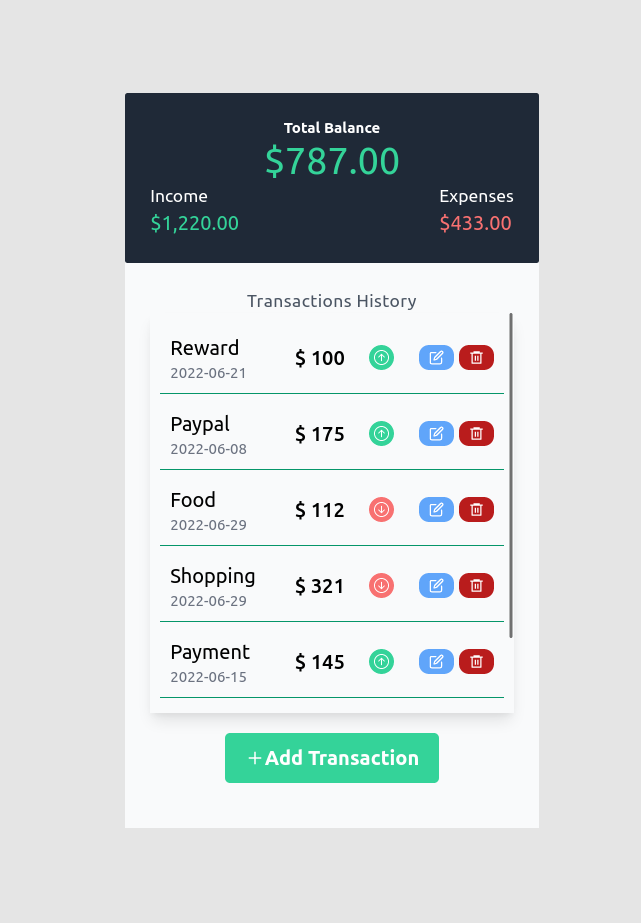
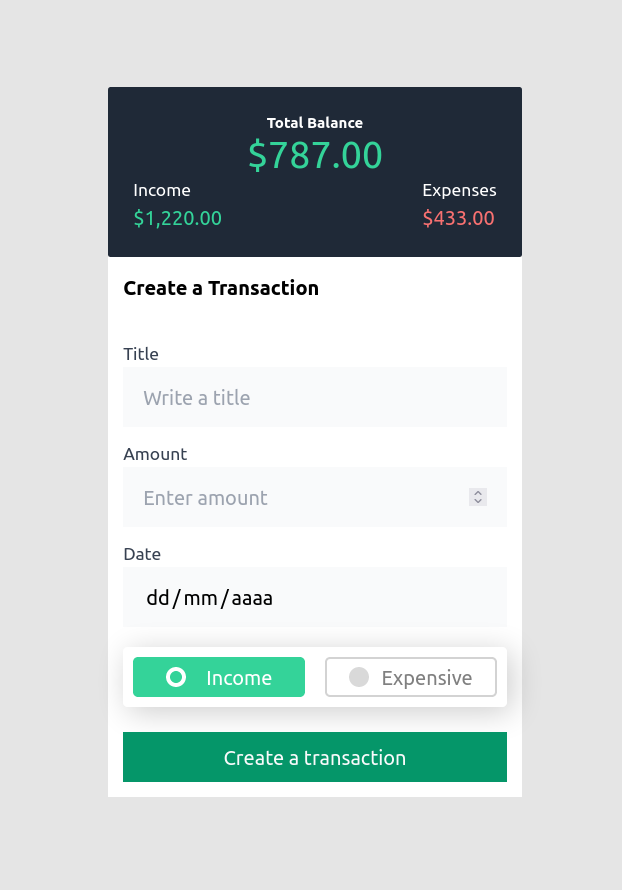

# Full Stack Budget App | React - NodeJS & MySQL

## Table of contents

-   [Overview](#overview)
    -   [Description](#description)
    -   [Screenshot](#screenshot)
-   [My process](#my-process)
-   [What I learned](#my-process)
-   [Author](#author)

## Overview

Traducir esta página

### Description

Develop an application for personal budget management. It should allow to create and edit cash inflows and outflows, and show a balance sheet resulting from the recorded transactions.
operations recorded.

### Screenshot

## My process

### Front-End | Built with:

-   React JS
-   Context API
-   Hooks: useContext, useEffect, useState, useNavigate, useParams
-   Tailwind CSS

### Back-End | Built with:

-   NodeJS
-   Express
-   MySQL

## What I learned?

-   Implement a crud using Context API
-   Implement the backend using Node JS and MySQL.

## Author

-   Cristian Unigarro
